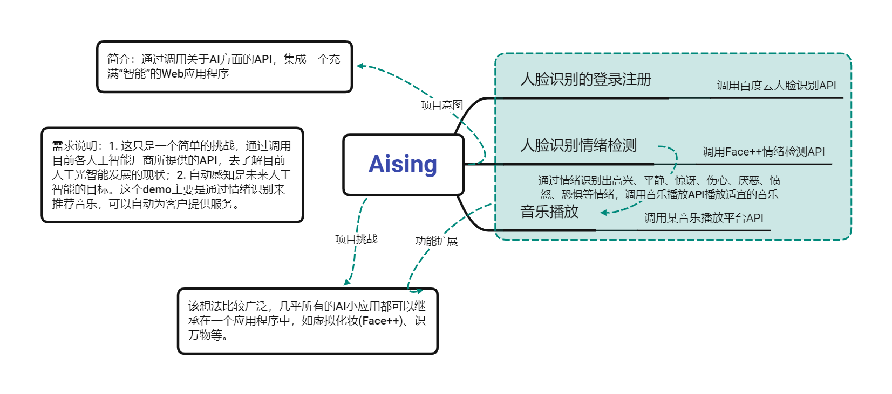
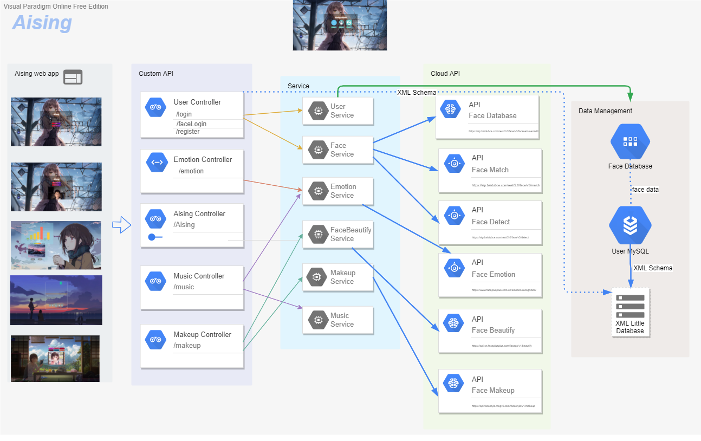
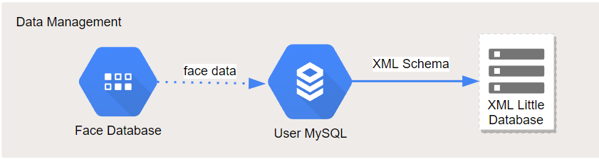
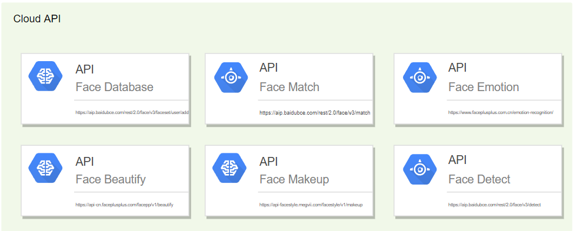
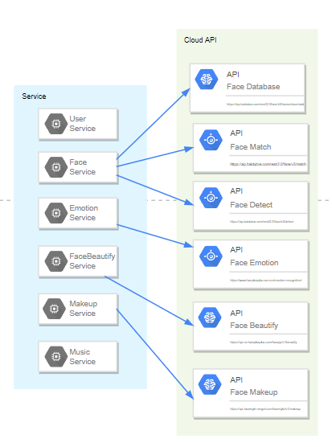
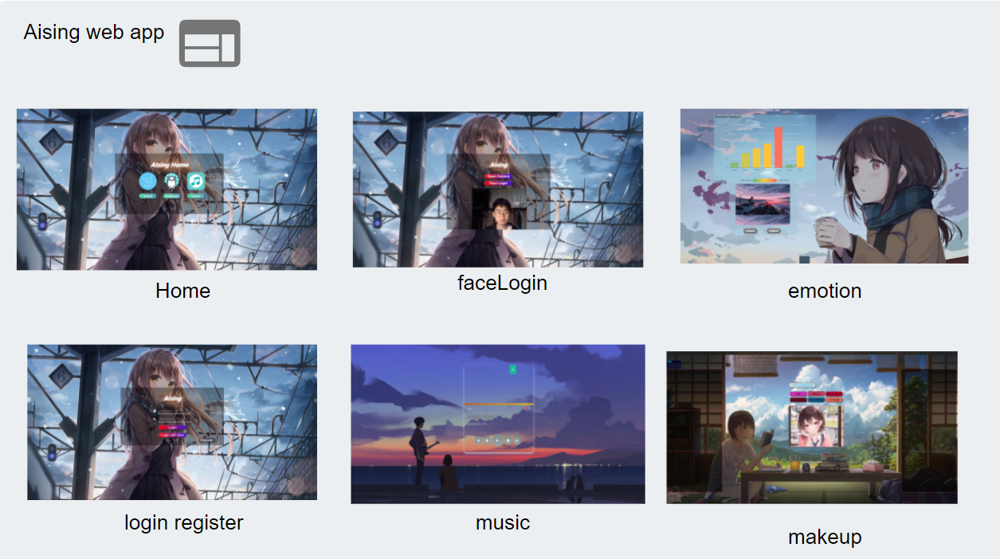
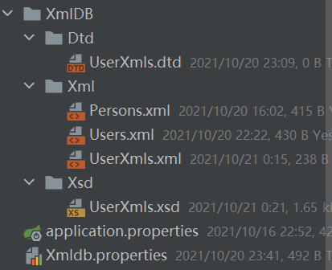
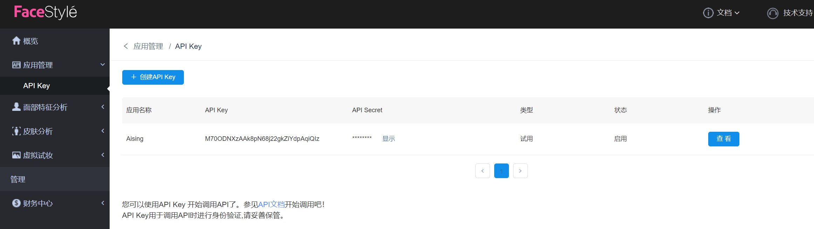
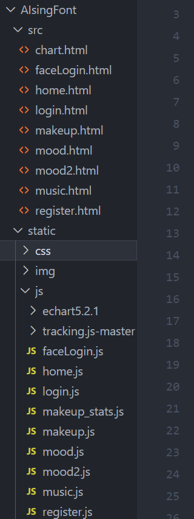

[TOC]

# Aising

- 学院：同济大学软件学院
- 指导老师：刘岩
- 姓名：李林飞
- 学号：1951976
- 项目名称：Aising
- 名称含义：AI Sing --- 一个用AI技术创建的“爱sing”应用程序，用AI改变世界

- 使用技术：
  - 前端：js + html + css + Fetch + Echarts + tracking.js
  - 后端：Spring Boot + Maven + MySQL + XML + JSON + XML schema + DOM4J + JPA


## 1. 项目说明



- **项目简介**：这是一个简单的demo。通过调用百度云、Face++、FaceStyle等各大产商提供的API，集成开发一个简单的“智能体验”应用程序。
- **项目目的**：在使用课程知识的基础上去了解目前人工智能技术在应用阶段的状况。
- **项目需求**：目前，人工智能技术已经处于应用阶段，也就是在短时间内其理论上的突破是很难做到的。然而，人工智能技术也存在落地困难的挑战。虽然它现在被运用到很多方面，比如广告、人脸登录等，但这离真正的“人工智能”还相差甚远。因此，项目聚焦于自动感知的探索，先通过人脸登录注册体会智能技术的便捷性，然后通过情绪检测获得用户的实时情绪，并通过不同情绪推荐适合用户心情的歌曲。


## 2. 架构设计



### 2.1 Data Management 模块

- **模块说明：**该模块主要是对应用数据的管理，其中包括存储用户数据的`User MySQL`、存储人脸信息的人脸库`Face Database`以及用于缓存和校验作用的自动小型XML数据库(`XML Little Database`)。
- **模块逻辑**：



该模块主要为用户登录注册提供数据服务。在用户注册时，将用户信息(账号、密码)以及人脸信息存储在`User MySQL`和`XML Little Database`中，并通过XML Schema校验数据(这只是一个简单的应用，实际上XML校验可以用于对所有访问数据的校验)。而只将自动分配的用户`Id`和人脸信息存储在[API提供方的人脸库](https://aip.baidubce.com/rest/2.0/face/v3/faceset/user/add)中，这样，当使用人脸登录时，我们可以在人脸库中通过[人脸匹配API](https://aip.baidubce.com/rest/2.0/face/v3/match)进行分析处理。


### 2.2 Cloud API 模块

- **模块说明：**该模块是关于第三方API的说明。主要来自百度云、Face++、FaceStyle。由于这些API都需要权限认证以及繁琐的数据处理，很难直接调用，因此我通过`Service`模块来组织使用这些API。

- **模块逻辑：**




`Face Database`: https://aip.baidubce.com/rest/2.0/face/v3/faceset/user/add

`Face Match`:https://aip.baidubce.com/rest/2.0/face/v3/match

`Face Detect`: https://aip.baidubce.com/rest/2.0/face/v3/detect

`Face Emotion`:https://api-cn.faceplusplus.com/facepp/v3/detect

`Face Beautify`:https://api-cn.faceplusplus.com/facepp/v1/beautify

`Face Makeup`:https://api-facestyle.megvii.com/facestyle/v1/makeup

### 2.3 Service 模块

- **模块说明：**该模块负责对API的调用。其中包括权限认证、数据类型转换、数据处理、数据糅合、自定义服务等。
- **核心工作：**权限认证申请、将人脸图像数据统一编码格式、具体逻辑功能实现等。

- **模块逻辑：**

  

  - `User Service`: 该Service向用户提供普通的登录注册服务，将用户基本信息存入`MySQL`数据库以及从数据库中比对用户信息等功能。

  - `Face Service`:该Service通过集合`Face Detect`,`Face Database`.`Face Match`的接口数据，为用户提供人脸注册登录服务。
  - `Emotion Serrvice`:该Service提供人脸情绪识别服务。
  - `Makeup Service`:该Service提供虚拟化妆(唇膏、口红)等服务。
  - `FaceBeautify Service`: 该Service提供面部美颜、美白的功能。
  - `Music Servce`:用于没有找到通过情绪推荐歌曲的API，所以我自己存了几首对应情绪的歌曲。该Service通过情绪返回不同风格的音乐。


### 2.4 Custom API 模块

- **模块说明：**该模块是对各个Service数据的整合以提供统一的接口。也就是说，每个Service的数据交互仅在该模块(`Controller`)完成。

- **模块逻辑：**通过对不同的sevice进行调用，为前端提供了7个可用的API。(还未部署，默认localhost:8080)


- 普通登录：http://127.0.0.1:8080/login
- 注册：http://127.0.0.1:8080/register
- 人脸登录:http://127.0.0.1:8080/faceLogin
- 情绪检测:http://127.0.0.1:8080/emotion
- 音乐播放：http://127.0.0.1:8080/music
- 虚拟化妆：http://127.0.0.1/makeup
- 化着状、根据情绪听着歌：http://127.0.0.1:8080/Aising


### 2.5 Aising web app 模块

- **模块说明：**采用前后端分离技术，该模块通过调用自定义的API为用户提供具体服务。

- **模块逻辑：**




## 2. 设计与实现

- 说明：将通过使用流程讲解部分实现流程(完整内容见答辩)。
- 该项目采用前端分离的模式，由于时间原因，还未完成部署。

### 2.1 前端设计与实现

- **界面**(Emotion Analysis): 界面设计比较简单，基本只需要能完成显示即可。


- **前端人脸捕捉**：通过使用`tracking.js`在前端完成人脸捕捉，帮助用户进行人脸相关的服务。

- **数据局部刷新**：通过使用`Echart5.2.1`完成数据实时显示。

- **数据接受与处理**:Service将所有图像数据都规定使用Base64编码，因此我们获取图像后，需要转换为Base64数据传给后端:

  ```js
  var formdata = new FormData();
                  formdata.append("faceBase64",
                      "" + faceBase);
                  var requestOptions = {
                      method: 'POST',
                      body: formdata,
                      redirect: 'follow'
                  };
  ```

  后端预处理后返回json数据:

  ```json
   {
       "emotion":
       {
           "surprise":1.873,
           "happiness":0.053,
           "neutral":97.987,
           "sadness":0.004,
           "disgust":0.004,
           "anger":0.074,
           "fear":0.004
       }
   }
  ```

  数据实时显示部分采用echarts完成：

```js
                fetch("http://127.0.0.1:8080/emotion",
                    requestOptions).then(response => response.text()).then(result => {
                    // alert(result);
                    emotion = JSON.parse(result.split(','));
                    EmotionList = [
                        'surpr',
                        'happi',
                        'neutr',
                        'sadne',
                        'disgu',
                        'anger',
                        'fear'
                    ];
                    EmotionValue = [
                        emotion.surprise + 1,
                        emotion.happiness + 1,
                        emotion.neutral + 1,
                        emotion.sadness + 1,
                        emotion.disgust + 1,
                        emotion.anger + 1,
                        emotion.fear + 1
                    ];
                    myChart.hideLoading(); //隐藏加载动画
                    myChart.setOption({
                        title: {
                            text: '情绪分析'
                        },
                        tooltip: {},
                        legend: {
                            data: 'score(%)'
                        },
                        grid: {
                            containLabel: true
                        },
                        visualMap: {
                            orient: 'horizontal',
                            left: 'center',
                            min: 0,
                            max: 100,
                            text: ['High Score', 'Low Score'],
                            // Map the score column to color
                            dimension: 1,
                            inRange: {
                                color: ['#65B581', '#FFCE34', '#FD665F']
                            }
                        },
                        xAxis: {
                            data: EmotionList
                        },
                        yAxis: {}, //注意一定不能丢了这个，不然图表Y轴不显示
                        series: [{
                            // 根据名字对应到相应的系列，并且要注明type
                            name: 'score',
                            type: 'bar',
                            data: EmotionValue
                        }]
                    });
                }).catch(error => {
                    console.log('error', error);
                    //请求失败时执行该函数
                    alert("图表请求数据失败!");
                    myChart.hideLoading();
                });
```


### 2.2 后端设计与实现

#### 2.2.1 Controller

- 集合`Service`模块向提供访问的API。以`UserController`进行说明。

```java
/**
 * User test Controller
 */

@CrossOrigin
@Controller // This means that this class is a Controller
@RequestMapping("") // This means URL's start with / (after Application path)
public class UserController {

    @Autowired // 只有当接口和实现都添加@Service注解才生效
    public IUserService userService;

    @Autowired
    public IFaceService faceService;

    @PostMapping(path="/register")
    public @ResponseBody
    String addUser(@RequestParam String name, @RequestParam String password, @RequestParam String faceBase64){
     ...
    }

    // 账号登录
    @JsonProperty
    @PostMapping(path = "/login")
    public @ResponseBody
    String accountLogin(@RequestParam String name, @RequestParam String password){
	...
    }

    // 人脸识别登录
    @PostMapping(path = "/faceLogin")
    public @ResponseBody String faceLogin(@RequestParam String faceBase64){
	...
    }

}
```

该`Controller`通过调用Service提供的接口来组装一个可用的API。

```java
 	@Autowired // 只有当接口和实现都添加@Service注解才生效
    public IUserService userService;
    @Autowired
    public IFaceService faceService;
```

举注册是作为说明：通过` @PostMapping(path="/register")`向外部提供一个接口。当前端将用户注册信息传回来时，调用`userService`将用户数据存储在数据库中；调用` XmlCrud<UserXml> xmlCrud = new XmlCrud<>(UserXml.class);`将用户数据写入`XML Little Database`中；调用`ValidataXMLTest<UserXml> userXmlValidataXMLTest = new ValidataXMLTest<>(UserXml.class);`对XML中数据进行校验；调用`faceService`将人脸信息添加到人脸库中。最后向前端发送注册成功或失败的消息。

```java
/**
     * 注册时需要是FaceService与UserService通信的实例
     * step: [1] 从前端返回的账号、密码和人脸图像数据需要分开处理
     *       [2] 账号、密码和图像需要存入数据库中备份
     *       [3] 人脸数据单独注册到百度云的人脸库中
     * @param name 账号名称
     * @param password 密码
     * @param faceBase64 人脸图像信息 Base64格式
     * @return 返回注册结果提示消息
     */
    @PostMapping(path="/register")
    public @ResponseBody
    String addUser(@RequestParam String name, @RequestParam String password, @RequestParam String faceBase64){
        User user = userService.register(name, password, faceBase64);  // 数据人脸存储备份

        // XML 缓存数据
        XmlCrud<UserXml> xmlCrud = new XmlCrud<>(UserXml.class);
        UserXml userXml = new UserXml();
        userXml.setUserId(user.getId().toString());
        userXml.setUserName(user.getUserName());
        userXml.setUserPasswd(user.getUserPasswd());
        userXml.setUserPhoto("Photo Base64");
        xmlCrud.save(userXml);

        // XML 数据校验
        ValidataXMLTest<UserXml> userXmlValidataXMLTest = new ValidataXMLTest<>(UserXml.class);
        if(userXmlValidataXMLTest.validateXMLByXSD()){
            String res = faceService.faceRegister(user.getId().toString(), name, faceBase64);  // 百度云人脸注册, id与数据库保持一致
            return  "{{" + user + "}" + "," + res + "}";
        }else {
            System.out.println("用户数据错误！！1");
            return "FAILED";
        }
    }
```

#### 2.2.2 I...Service

-  `I...Service`是对具体`Service`接口。如`IUserService`

```java
@Service
public interface IUserService {

    // 注册用户
    User register(String name, String password, String photo);

    // 查询用户--- 账号登录
    String accountLogin(String name, String password);
}
```

#### 2.2.3 Service

- `Service`是调用API实现具体逻辑的地方。如`FaceService`:
- **调用权限认证**：需要向百度云平台申请调用权限，你将获得`AppID`、`App Key`、`App Secret`，通过他们可以获取接入验证的`token`

```java
 	// AppID
    private static final String AppID = "24970557";
    // API KEY
    private static final String AK = "KtUMfpceHyNGHr1QXj7qIU4Y";
    // Secret Key
    private static final String SK = "5mVnxvPkIbAkdk3bPSEoabIklDWTc6LC";
	
	/**
     * 获取API访问token
     * 该token有一定的有效期，需要自行管理，当失效时需重新获取.
     * ak - 百度云官网获取的 API Key
     * sk - 百度云官网获取的 Securet Key
     * @return assess_token 示例：
     * "24.460da4889caad24cccdb1fea17221975.2592000.1491995545.282335-1234567"
     */
    private static String getAuth() {
        // 获取token地址
        String authHost = "https://aip.baidubce.com/oauth/2.0/token?";
        String getAccessTokenUrl = authHost
                // 1. grant_type为固定参数
                + "grant_type=client_credentials"
                // 2. 官网获取的 API Key
                + "&client_id=" + AK
                // 3. 官网获取的 Secret Key
                + "&client_secret=" + SK;
        try {
            URL realUrl = new URL(getAccessTokenUrl);
            // 打开和URL之间的连接
            HttpURLConnection connection = (HttpURLConnection) realUrl.openConnection();
            connection.setRequestMethod("GET");
            connection.connect();
            // 获取所有响应头字段
            Map<String, List<String>> map = connection.getHeaderFields();
            // 遍历所有的响应头字段
            for (Object key : ((Map<?, ?>) map).keySet()) {
                System.err.println(key + "--->" + map.get(key));
            }
            // 定义 BufferedReader输入流来读取URL的响应
            BufferedReader in = new BufferedReader(new InputStreamReader(connection.getInputStream()));
            StringBuilder result = new StringBuilder();
            String line;
            while ((line = in.readLine()) != null) {
                result.append(line);
            }
```

- **数据处理**：有的接口只接受二进制文件数据，所以需要进行格式转换。

```java
/**
     * 将Base64图像转换为二进制
     * @param f 图像数据
     * @return 二进制字节
     */
    public static byte[] getBytesFromFile(String f) {
        if (f == null) {
            return null;
        }
        try {
            FileInputStream stream = new FileInputStream(f);
            ByteArrayOutputStream out = new ByteArrayOutputStream(1000);
            byte[] b = new byte[1000];
            int n;
            while ((n = stream.read(b)) != -1)
                out.write(b, 0, n);
            stream.close();
            out.close();
            return out.toByteArray();
        } catch (IOException ignored) {
        }
        return null;
    }
```

- **发送请求**：组合出API所需要的数据，通过json进行传输。

```java
/**
     * 人脸检测，返回face_token: 人脸的唯一标识，为人脸注册做准备
     * @param faceBase64 人脸的base64编码
     * @return face_tocken
     */
    private static String faceDetect(String faceBase64){

        // 请求url
        String url = "https://aip.baidubce.com/rest/2.0/face/v3/detect";
        try {
            Map<String, Object> map = new HashMap<>();
            map.put("image", faceBase64);
            map.put("face_field", "age,emotion"); // 默认只返回face_token
            map.put("image_type", "BASE64");

            String param = GsonUtils.toJson(map);

            String accessToken = getAuth();
//            System.out.println("token: " + accessToken);

            return HttpUtil.post(url, accessToken, "application/json", param);
        } catch (Exception e) {
            e.printStackTrace();
        }
        return null;
    }
```

- **接受数据处理**：API所返回的数据有很多信息，我们需要进行解析提取后以便`Controller`使用。

```java
 /**
     * 从faceDetect返回的json数据中解析出face_token
     * @param faceDetectRes
     * @return
     */
    /**
     * {
     *   "error_code":0,
     *   "error_msg":"SUCCESS",
     *   "log_id":4535201752012,
     *   "timestamp":1634437681,
     *   "cached":0,
     *   "result":
     *   {
     *     "face_num":1,
     *     "face_list":[
     *       {
     *         "face_token":"f9b80fcb787e9f1852812918f8905b84",
     *         "location":{"left":124.44,"top":67.11,"width":87,"height":63,"rotation":0},
     *         "face_probability":1,
     *         "angle":{"yaw":-9.07,"pitch":12.58,"roll":-1.43},
     *         "age":23,
     *         "emotion":{"type":"happy","probability":0.78}
     *       }
     *     ]
     *   }
     * }
     */
    private static String getFaceToken(String faceDetectRes){
        // [1] 转成json数据
        JSONObject faceResult = new JSONObject(faceDetectRes);
        // [2] 提取result数据
        JSONObject result = faceResult.getJSONObject("result");
        //[3] 注意：face_list中的内容带有中括号[]，所以要转化为JSONArray类型的对象
        JSONArray face_list = result.getJSONArray("face_list");
        // [4] 获取face_token
        return face_list.getJSONObject(0).getString("face_token");
    }
```

### 2.3 XML Little Database

- 通过使用java的泛型和反射，可以将用户定义的任意类型的数据存入到XML文件中。该部分的主要目的是当数据较多时，为了降低延迟，可以先将数据缓存在XML文件中，然后在去使用。

- **调用方法**：其中` XmlCrud<UserXml> xmlCrud = new XmlCrud<>(UserXml.class);`声明了一个通过用户数据类型`UserXml`创建XML文件的上下文`XmlCrud`,然后你可以通过该上下文对数据进行处理，如存储(`save`)、查找`findById`等功能。

```java
 		// XML 缓存数据
        XmlCrud<UserXml> xmlCrud = new XmlCrud<>(UserXml.class);
        UserXml userXml = new UserXml();
        userXml.setUserId(user.getId().toString());
        userXml.setUserName(user.getUserName());
        userXml.setUserPasswd(user.getUserPasswd());
        userXml.setUserPhoto("Photo Base64");
        xmlCrud.save(userXml);
```

- `XmlCrud`实现：

```java
public class XmlCrud<T> {

    /**
     * XML 数据库存储路径，由配置文件 Xmldb.properties指定
     * 用户只需要在资源文件目录下配置使用即可
     */
    private static String XmldbPath = null;

    private static String InstancePath = null;

    private static String ClassName = null;

    private static Class InstanceClass = null;

    /**
     * 构造函数：创建构造函数的同时加载配置文件，配置全局的数据库存储路径
     */
    public XmlCrud(Class<T> tClass) {
        /**
         * [1] 加载配置文件
         */
        // 创建对象
        Properties pro = new Properties();
        // 加载配置文件，转换为一个集合 --- 类加载器
        // 获取class目录下的配置文件
        ClassLoader classLoader = XmlCrud.class.getClassLoader();
        // 获取字节流 --- 找到配置文件并加载为字节流
        InputStream inputStream = classLoader.getResourceAsStream("Xmldb.properties");
        // 错误处理
        Assert.notNull(inputStream, "Properties  file not found");

        try {
            pro.load(inputStream);
        } catch (IOException e) {
            e.printStackTrace();
        }

        /**
         *  [2] 获取配置文件中定义的数据
         */
        // 配置文件中读取数据库路径
        XmldbPath = pro.getProperty("XmldbPath");
        // 类名 ---- 加s成为根元素
        InstanceClass = tClass;
        ClassName = tClass.getSimpleName();
        InstancePath = XmldbPath + "\\" + ClassName + "s.xml";
    }

    /**
     * 数据存储
     *
     * @param entity 实例类
     */

    @SafeVarargs
    public final void save(T... entity) {
	...
    }


    /**
     * 解析XML文件：通过XML文件创建实例
     *
     * @param entity 传入类，eg:User.class
     * @return 返回该类的实例对象
     */
    public List<T> init(Class<T> entity) {
	...
    }

    /**
     * 根据ID删除XML数据库中的数据
     *
     * @param id 需要删除元素的id
     */
    public final void deleteById(String id) {
	...
    }

    /**
     * 根据ID寻找对象
     *
     * @param id 元素ID
     * @return 返回相同ID组成的对象
     */
    public T findById(String id) {
	...
    }


    public T updateById(String oldValue, String newValue){
	...
    }
}
```

- 你可以通过配置文件`Xmldb.properties`来指定你的XML文件存储路径。

```properties
# XMLdb data store path
XmldbPath=D:\\AllFile\\LearningFile\\Code\\SpringBoot\\Aising\\src\\main\\resources\\XmlDB\\Xml
```

- 写入XML文件示例

```xml
<?xml version="1.0" encoding="UTF-8"?>

<UserXmls>
  <UserXml>
    <userId>41</userId>
    <userName>2216155077@qq.com</userName>
    <userPasswd>123131ksdfhsiz</userPasswd>
    <userPhoto>Photo Base64</userPhoto>
  </UserXml>
</UserXmls>
```


### 2.4 XML Schema校验XML文件

- 对于写入的XML文件，我们可以先进行校验，检查数据是否合理，然后再将其传向需要的应用，这样可以大大降低系统出错的可能性。通过泛型和java反射我写了一个支持任意类型的XML文件数据的校验。由于时间原因，对于通过监听文件变化来进行动态校验的功能还没写。

- **调用方法**：通过` ValidataXMLTest<UserXml> userXmlValidataXMLTest = new ValidataXMLTest<>(UserXml.class);`声明调用对象，然后就可以通过

`validateXMLByXSD()`或者`validateXMLByDTD`对XML文件进行校验，只有通过校验的数据才能继续读取使用。

```java
		// XML 数据校验
        ValidataXMLTest<UserXml> userXmlValidataXMLTest = new ValidataXMLTest<>(UserXml.class);
        if(userXmlValidataXMLTest.validateXMLByXSD()){
            String res = faceService.faceRegister(user.getId().toString(), name, faceBase64);  // 百度云人脸注册, id与数据库保持一致
            return  "{{" + user + "}" + "," + res + "}";
        }else {
            System.out.println("用户数据错误！！1");
            return "FAILED";
        }
```

- **配置文件**：你可以通过配置文件来指定你需要校验的XML文件和Schema文件的文件夹，只需要保证两者命名相同，它将自动匹配进行校验。

```properties
# ValidataXMLTest XmlPath
XmlPath=D:\\AllFile\\LearningFile\\Code\\SpringBoot\\Aising\\src\\main\\resources\\XmlDB\\Xml

# ValidataXMLTest DtdPth
DtdPath=D:\\AllFile\\LearningFile\\Code\\SpringBoot\\Aising\\src\\main\\resources\\XmlDB\\Dtd

#  ValidataXMLTest XsdPath
XsdPath=D:\\AllFile\\LearningFile\\Code\\SpringBoot\\Aising\\src\\main\\resources\\XmlDB\\Xsd
```

​	

对上述文件进行校验的XML Schema文件如下：

```xml
<?xml version="1.0" encoding="UTF-8" ?>

<xs:schema xmlns:xs="http://www.w3.org/2001/XMLSchema"
           elementFormDefault="qualified">
    <!-- xmlns:xs="http://www.w3.org/2001/XMLSchema" -->
    <!--  显示 schema 中用到的元素和数据类型来自命名空间 "http://www.w3.org/2001/XMLSchema"。
    同时它还规定了来自命名空间 "http://www.w3.org/2001/XMLSchema" 的元素和数据类型应该使用前缀 xs：  -->

    <!--    targetNamespace="http://www.w3school.com.cn"
        显示被Schema定义的元素来自命名空间 http://www.w3school.com.cn
    -->

    <!-- xmlns="http://www.w3school.com.cn"
        指出默认名称空间为 http://www.w3school.com.cn
    -->

    <!--  elementFormDefault="qualified"
          指出任何 XML 实例文档所使用的且在此 schema 中声明过的元素必须被命名空间限定。
     -->

    <xs:element name="UserXmls">
        <xs:complexType>
            <xs:sequence>
                <xs:element name="UserXml" minOccurs="0" maxOccurs="unbounded">
                    <xs:complexType>
                        <xs:sequence>
                            <xs:element name="userId" type="xs:string"/>
                            <xs:element name="userName" type="xs:string"/>
                            <xs:element name="userPasswd" type="xs:string"/>
                            <xs:element name="userPhoto" type="xs:string"/>
                        </xs:sequence>
                    </xs:complexType>
                </xs:element>
            </xs:sequence>
        </xs:complexType>
    </xs:element>

</xs:schema>
```


## 3. 配置说明

### 3.1 后端配置


- 使用Spring Boot + Maven框架，一键配置安装所以依赖。
- MySQL数据库：Spring Boot的配置文件中可以帮助简单的连接数据库。简单SQL脚本如下：

```sql
create table hibernate_sequence
(
    next_val bigint null
);

create table users
(
    user_id     int         not null
        primary key,
    user_name   varchar(20) not null,
    user_passwd varchar(30) not null,
    user_photo  longtext    null
);
```

- API token获取：只需在API平台上注册一个AppID账号即可使用，在service中进行更改，如：

```java
 	// AppID
    private static final String AppID = "24970557";
    // API KEY
    private static final String AK = "KtUMfpceHyNGHr1QXj7qIU4Y";
    // Secret Key
    private static final String SK = "5mVnxvPkIbAkdk3bPSEoabIklDWTc6LC";
```



- XML解析库：dom4j。该库在lib文件夹下，只需导入即可使用。

### 3.2 前端配置

- 可以直接使用
- 由于还没有部署，前端发送请求默认为`http://127.0.0.1:8080/`,你可以修改js文件中的`fetch`部分与后端进行交互。


